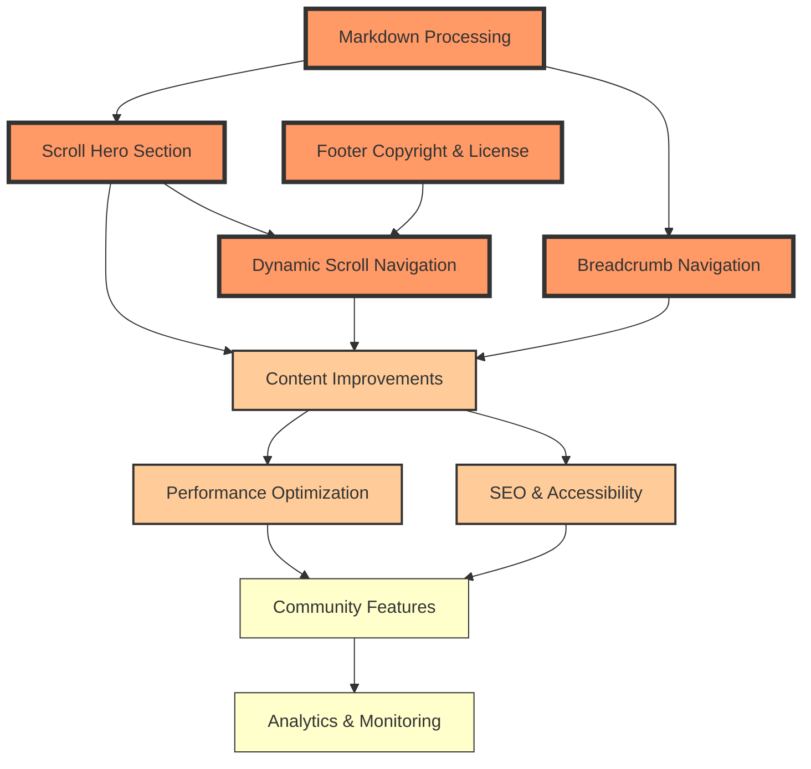

# GitScrolls Website Roadmap

## Feature Dependency Graph

## Design Principles

All features should follow these principles:
- **Mobile-first responsive design**
- **Consistent with ancient scrolls aesthetic**
- **Performance-conscious implementation**
- **Accessible to all users**
- **Maintainable and well-documented code**

## Implementation Order

Based on dependencies and user impact:
1. **Markdown Processing** (foundation for other features)
2. **Scroll Hero Section** (biggest visual impact)
3. **Footer Copyright** (quick win)
4. **Dynamic Navigation** (enhanced UX)
5. **Breadcrumb Navigation** (advanced feature)

## Phase 1: Core Features

### 1. Markdown Processing
**Priority: 1 - Foundation**
- [x] Create markdown processor function
- [x] Remove YAML frontmatter
- [x] Remove navigation footer
- [x] Extract quote section
- [x] Extract poem section
- [x] Extract subtitle section
- [x] Handle actual GitScrolls markdown structure
- [x] Clean up redundant headers
- [x] Test with all 10 scrolls
- [x] Handle edge cases

### 2. Scroll Hero Section
**Priority: 2 - Visual Impact**
- [x] ~~Create `scrolls-metadata.json` with scroll information~~ (Removed - using dynamic parsing instead)
- [x] Extract and display quote prominently (via MarkdownProcessor)
- [x] Design and implement hero section layout
- [x] Add background image support for each scroll
- [x] Create poem section below hero
- [x] Add scroll-down indicator animation
- [x] Test responsive design for hero sections

### 3. Footer with Copyright & License
**Priority: 3 - Quick Win**
- [x] Design footer layout with three sections
- [x] Add copyright information with dynamic year
- [x] Include license details and links
- [x] Add GitHub repository links
- [x] Implement "Fork this" call-to-action
- [x] Apply footer to both index.html and scroll.html
- [x] Style footer with site theme

### 4. Dynamic Scroll Navigation Dropdown
**Priority: 4 - Enhanced UX**
- [x] Create dropdown component for scroll pages
- [x] Implement GitHub API integration to fetch scroll list
- [x] Add caching mechanism (localStorage, 1-hour expiry)
- [x] Build dropdown menu dynamically
- [x] Highlight current scroll in dropdown
- [x] Add keyboard navigation support
- [x] Handle loading and error states
- [x] Test on mobile devices

### 5. Breadcrumb Navigation with TOC
**Priority: 5 - Advanced Feature**
- [x] Design breadcrumb navigation bar
- [x] Implement sticky positioning
- [x] Generate table of contents from headings
- [x] Create TOC dropdown component
- [x] Add scroll position tracking
- [x] Update current section indicator
- [x] Implement smooth scroll to sections
- [x] Add reading progress bar
- [x] Make mobile responsive

## Phase 2: Enhancements

### Content Improvements
- [x] Add images between scroll sections
- [x] Implement lazy loading for images
- [x] Add social sharing buttons
- [x] Create print-friendly styles
- [x] **Infinite Scroll Mode** - Seamless reading experience through all scrolls

### Performance
- [x] Optimize image loading
- [x] Implement service worker for offline access
- [x] Add progressive enhancement
- [ ] Minimize JavaScript bundle size

### SEO & Accessibility
- [x] Add meta descriptions for each scroll
- [x] Implement Open Graph tags
- [x] Ensure ARIA labels on interactive elements
- [x] Test with screen readers
- [x] Add skip navigation links

## Phase 3: Future Features

### Dark Mode
- [x] Implement CSS variables for theming
- [x] Create dark color scheme
- [x] Add theme toggle button to navigation
- [x] Store user preference in localStorage
- [x] Respect system dark mode preference
- [x] Update all pages to support dark mode

### Community Features
- [ ] Add comments section (GitHub Discussions integration)
- [ ] Create contributor gallery
- [ ] Add "remix this scroll" functionality

### Analytics & Monitoring
- [x] Add privacy-friendly analytics (Umami)
- [x] Track scroll completion rates
- [x] Monitor performance metrics

## Technical Debt
- [x] Refactor shared code into modules
- [x] Add build process for optimization (Vite)
- [x] Create component library
- [x] Add automated testing (Jest)
- [x] Set up continuous deployment (GitHub Actions)

## Feature Documentation

Detailed planning documents for each feature are available in `/docs/features/`:

1. **[Scroll Hero Section](./docs/features/scroll-hero-section.md)**
   - Full hero sections for each scroll with background images
   - Quote and poem display
   - Visual hierarchy improvements

2. **[Footer Copyright & License](./docs/features/footer-copyright.md)**
   - Comprehensive footer design
   - Copyright and license information
   - Call-to-action for contributions

3. **[Dynamic Scroll Navigation](./docs/features/dynamic-scroll-navigation.md)**
   - Dropdown navigation for scroll pages
   - GitHub API integration
   - Caching and performance considerations

4. **[Markdown Processing](./docs/features/markdown-processing.md)**
   - Frontmatter and footer removal
   - Content extraction strategies
   - Quote and poem identification

5. **[Breadcrumb Navigation](./docs/features/breadcrumb-navigation.md)**
   - Secondary navigation with current location
   - Dynamic table of contents
   - Reading progress indicator

6. **[Infinite Scroll Mode](./docs/features/infinite-scroll.md)**
   - Continuous reading experience
   - Dynamic loading and unloading
   - Smart memory management

## Notes
- Test all features across Chrome, Firefox, Safari, and Edge
- Ensure mobile-first approach for all new features
- Each feature has detailed planning in `/docs/features/`