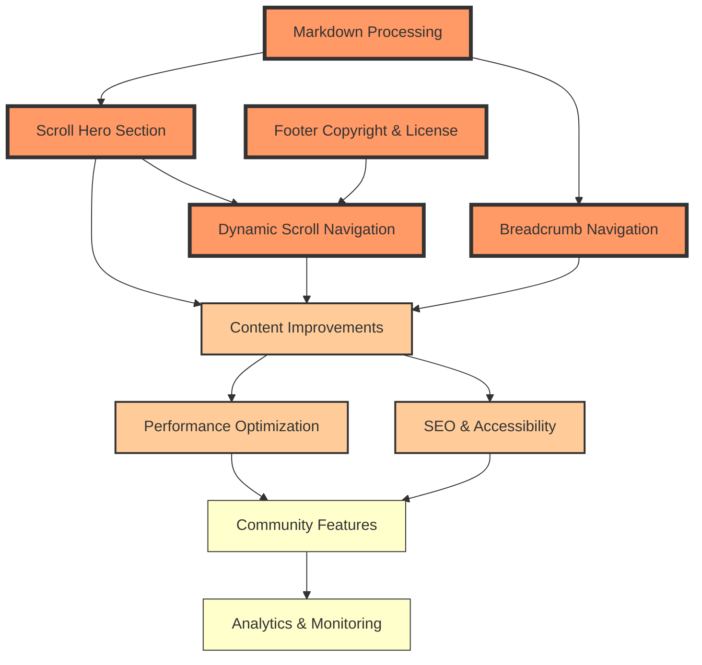

# GitScrolls Website Roadmap

## Feature Dependency Graph

## Design Principles

All features should follow these principles:
- **Mobile-first responsive design**
- **Consistent with ancient scrolls aesthetic**
- **Performance-conscious implementation**
- **Accessible to all users**
- **Maintainable and well-documented code**

## Implementation Order

Based on dependencies and user impact:
1. **Markdown Processing** (foundation for other features)
2. **Scroll Hero Section** (biggest visual impact)
3. **Footer Copyright** (quick win)
4. **Dynamic Navigation** (enhanced UX)
5. **Breadcrumb Navigation** (advanced feature)

## Phase 1: Core Features

### 1. Markdown Processing
**Priority: 1 - Foundation**
- [x] Create markdown processor function
- [x] Remove YAML frontmatter
- [x] Remove navigation footer
- [x] Extract quote section
- [x] Extract poem section
- [x] Clean up redundant headers
- [x] Test with all 10 scrolls
- [x] Handle edge cases

### 2. Scroll Hero Section
**Priority: 2 - Visual Impact**
- [ ] Create `scrolls-metadata.json` with scroll information (titles, quotes, poems, hero images)
- [ ] Design and implement hero section layout
- [ ] Add background image support for each scroll
- [ ] Extract and display quote prominently
- [ ] Create poem section below hero
- [ ] Add scroll-down indicator animation
- [ ] Test responsive design for hero sections

### 3. Footer with Copyright & License
**Priority: 3 - Quick Win**
- [ ] Design footer layout with three sections
- [ ] Add copyright information with dynamic year
- [ ] Include license details and links
- [ ] Add GitHub repository links
- [ ] Implement "Fork this" call-to-action
- [ ] Apply footer to both index.html and scroll.html
- [ ] Style footer with site theme

### 4. Dynamic Scroll Navigation Dropdown
**Priority: 4 - Enhanced UX**
- [ ] Create dropdown component for scroll pages
- [ ] Implement GitHub API integration to fetch scroll list
- [ ] Add caching mechanism (localStorage, 1-hour expiry)
- [ ] Build dropdown menu dynamically
- [ ] Highlight current scroll in dropdown
- [ ] Add keyboard navigation support
- [ ] Handle loading and error states
- [ ] Test on mobile devices

### 5. Breadcrumb Navigation with TOC
**Priority: 5 - Advanced Feature**
- [ ] Design breadcrumb navigation bar
- [ ] Implement sticky positioning
- [ ] Generate table of contents from headings
- [ ] Create TOC dropdown component
- [ ] Add scroll position tracking
- [ ] Update current section indicator
- [ ] Implement smooth scroll to sections
- [ ] Add reading progress bar
- [ ] Make mobile responsive

## Phase 2: Enhancements

### Content Improvements
- [ ] Add images between scroll sections
- [ ] Implement lazy loading for images
- [ ] Add social sharing buttons
- [ ] Create print-friendly styles

### Performance
- [ ] Optimize image loading
- [ ] Implement service worker for offline access
- [ ] Add progressive enhancement
- [ ] Minimize JavaScript bundle size

### SEO & Accessibility
- [ ] Add meta descriptions for each scroll
- [ ] Implement Open Graph tags
- [ ] Ensure ARIA labels on interactive elements
- [ ] Test with screen readers
- [ ] Add skip navigation links

## Phase 3: Future Features

### Community Features
- [ ] Add comments section (GitHub Discussions integration)
- [ ] Create contributor gallery
- [ ] Add "remix this scroll" functionality

### Analytics & Monitoring
- [ ] Add privacy-friendly analytics
- [ ] Track scroll completion rates
- [ ] Monitor performance metrics

## Technical Debt
- [ ] Refactor shared code into modules
- [ ] Add build process for optimization
- [ ] Create component library
- [ ] Add automated testing
- [ ] Set up continuous deployment

## Feature Documentation

Detailed planning documents for each feature are available in `/docs/features/`:

1. **[Scroll Hero Section](./docs/features/scroll-hero-section.md)**
   - Full hero sections for each scroll with background images
   - Quote and poem display
   - Visual hierarchy improvements

2. **[Footer Copyright & License](./docs/features/footer-copyright.md)**
   - Comprehensive footer design
   - Copyright and license information
   - Call-to-action for contributions

3. **[Dynamic Scroll Navigation](./docs/features/dynamic-scroll-navigation.md)**
   - Dropdown navigation for scroll pages
   - GitHub API integration
   - Caching and performance considerations

4. **[Markdown Processing](./docs/features/markdown-processing.md)**
   - Frontmatter and footer removal
   - Content extraction strategies
   - Quote and poem identification

5. **[Breadcrumb Navigation](./docs/features/breadcrumb-navigation.md)**
   - Secondary navigation with current location
   - Dynamic table of contents
   - Reading progress indicator

## Notes
- Test all features across Chrome, Firefox, Safari, and Edge
- Ensure mobile-first approach for all new features
- Each feature has detailed planning in `/docs/features/`